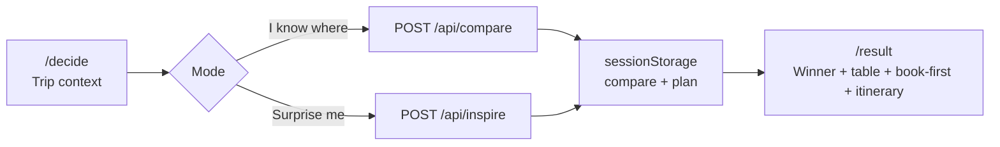

# XingAI Travel

**Make a better travel decision** — compare destinations first, plan second.

Production: [travel.xingai.app](https://travel.xingai.app)

XingAI Travel is a **travel decision system**, not an OTA or price-comparison wall. Users describe real trip constraints; the product compares a small set of destinations, names one winner with honest trade-offs, then offers a book-first checklist and itinerary. Affiliate links appear **after** the decision — they never influence ranking or confidence.

### URL architecture (frozen)

| URL | Role | Canonical |
|-----|------|-----------|
| `/` | Product home — explain the decision system | self (`/`) |
| `/zh`, `/ko`, `/es` (+ same paths) | Locale prefixes for indexable pages | self on that locale URL; `hreflang` across en/zh/ko/es |
| `/decide` | Decision tool — capture constraints and compare | self (`/decide` or `/zh/decide` …) |
| `/result`, `/trips` | Session / this-browser state | `noindex`, not in sitemap, no locale prefix |

English stays unprefixed. `proxy.ts` rewrites bare English URLs onto `/en/…` (internal `[locale]` segment); `/zh|ko|es/…` are real paths. `/` does **not** redirect to `/decide`.

### Title freeze (2026-10-05)

Public default title stays:

> **XingAI Travel — Make a better travel decision**

Do not thrash title / brand strings for ~30 days unless a factual error. Brand name in UI, OG, JSON-LD, and `llms.txt` is **XingAI Travel** (not “Travel AI — Explore Better”).

---

## Status (October 2026)

| Area | State |
|------|--------|
| **SEO signals (2026-10-05)** | Brand/title/OG/schema/`llms.txt` aligned to **XingAI Travel**. Chrome, footer, legal, and i18n no longer say “Travel AI” / “Explore Better”. Sitewide JSON-LD ships in the **first HTML** (not `afterInteractive`). `/decide` adds its own WebPage + WebApplication JSON-LD and self-canonical OG `url`. `/faq` and `/how-it-works` expose a visible AEO direct-answer block. Footer + drawer ship crawlable XingAI family anchors; `/legal/{privacy,terms,disclaimer}` redirect to local pages (project-init). Technical crawl of sitemap URLs: see [Indexability notes](#indexability-notes-2026-10-05). Google Search Console coverage still needs human confirmation (`site:` ≠ index). |
| **Decision result (2026-10-02)** | Result shows **XingAI Match Score** (0–100 from overall stars + confidence), factor bars for overall/walkability, ranked alternatives with **Why not {city}?**. Hero is result-oriented: “Stop searching. Start deciding.” + proof line (en / zh / ko / es). **Evidence panel** labels weather / flight / walkability / plan budget / match as estimate·derived·plan (no fake source URLs). Hero “How to use” starts **collapsed** on all breakpoints. |
| **SEO/AEO/GEO content graph (ADR 0009)** | Live intent pages: `/how-it-works`, `/faq`, `/compare` (+ 5 A-vs-B pages), `/guides` (+ 5 intent pages). `/decide` stays the conversion step. Fit labels stay qualitative. |
| **Locale URL paths (2026-10-06)** | Public indexable routes ship as `/`, `/zh/…`, `/ko/…`, `/es/…`. Middleware rewrite + `x-xingai-locale`. Language switcher updates the path. `pageMeta` / sitemap emit self-canonical + `hreflang` (en, zh-CN, ko, es, x-default). Session routes (`/result`, `/trips`, `/s`) stay unprefixed. |
| **Locale metadata (2026-10-06)** | Non-English locale URLs emit localized `<title>`, meta description, `og:title` / `og:description`, and story Article `headline` / `inLanguage`. Static copy lives in `lib/seo-page-copy.ts`; compare/guides/city/stories pick Localized fields. |
| **Locale static routes (2026-10-06)** | Indexable pages live under `app/[locale]` with `generateStaticParams`. `proxy.ts` rewrites bare English URLs to `/en/…` and leaves `/zh|ko|es/…` as-is. No `headers()` in the root layout — restores CDN-cacheable HTML. Legal pages add an Español blurb alongside 中文 / 한국어. |
| **Home (2026-10-05)** | `/` keeps the **4-slide hero carousel** (HK / Tokyo / Seoul / Cabo, 2560×1440) with a **centered segment bar under the hero** (not over the photo). Mobile: width-based **4:5** photo + copy below; per-slide mobile focal points; carousel **4.5s** opacity crossfade only — **no Ken Burns zoom**. After **Popular destinations**, **Editor picks / Worth seeing once** (Xi'an · HK · Los Cabos · Lisbon — editorial, not a ranking) → then **Search vs Decide**. **Start with Hong Kong** is title → wide photo → one primary CTA + text links. Primary Decide CTAs on **hero**, **How it works**, and **page-end**. Footer traveler banner + XingAI family links. |
| **Chrome More menu (2026-10-05)** | Desktop top nav: text-only Home / Decide / Stories / Trips + **More ▾** (Cities · Compare · Guides). Mobile drawer + bottom tabs keep icons. Footer Discover links stay for crawl. |
| **Brand mark (2026-10-05)** | Chrome uses `/assets/logo-mark.svg` — flat indigo tile + route + pin (no gradient shadow / paper plane). Also wired in desktop header, mobile title bar, drawer. `logo-full.svg` for light OG/marketing only. |
| **Default theme (2026-10-05)** | First visit defaults to **dark** (`localStorage` key `theme`; missing → dark). Blocking boot script + `<html class="dark">` avoid light flash. Toggle still switches light/dark; stored preference wins. |
| **Decide / City / Stories heroes (2026-10-05)** | Product **photo** heroes are **full-bleed** edge-to-edge (`page-hero-full`): `/decide`, `/city/*`, Stories season + episode stills. Episode **hero videos** stay phone-width (`max-w-[22.5rem]`, `object-contain`) — 720×1280 clips must not stretch full-bleed or they look soft. Body copy stays constrained below. HK city hero uses `/assets/home-hero-hong-kong.webp` (2560×1440). |
| **City guides batch (2026-10-06)** | Live on `/city`: Top 10 + **Xi'an** (Shaanxi 陕西 — not Shanxi 山西). Each guide 15–25 places + 3 routes (ADR 0008). `/city`: **search** + region chips + **trip-style intents** (First city / Beach & rest / Food-first / Culture & history) via `?intent=` / `?region=`. Home **Editor picks / Worth seeing once** + “Browse by trip style”. |
| **Score parity + OG (2026-10-06)** | Comparison table Match Scores include walkability and follow ranked column order; empty-origin uses field alert + focus (no Try again); Avoid demotion localized; remote-city OG uses high-res 2400×1260 JPG from HK hero. [ADR 0014](./docs/adr/0014-score-parity-og-hires.md). |
| **Constraint conflict + privacy (2026-10-06)** | When Avoid demotes every candidate, results show a conflict banner and a soft “closest among conflicts” label (not a clean Best match). Low-confidence Match Scores may sit below 52 so peers still separate. Privacy names OpenAI, IP/Redis limits, Analytics, local map/Trips, and `/s` encoding; legal 中文/한국어 blurbs are page-specific. Decide nights + Avoid/notes placeholders are localized. [ADR 0015](./docs/adr/0015-constraint-conflict-privacy-i18n.md). |
| **Traffic recovery (2026-10-06)** | Custom 404 → Decide / Cities / Home. FAQ internal links show human labels (not raw paths). Decide chrome CTA on `/decide` scrolls to `#trip-form`. Stories index states publisher-only (no UGC) + Decide CTA. [ADR 0016](./docs/adr/0016-traffic-404-faq-stories.md). |
| **Story interest gauge (2026-10-06)** | Stories index / season / episode offer a mailto interest CTA (“we don’t publish reader stories yet”) + `story_submit_interest` track. No coming soon, no photo upload. Privacy covers voluntary emails. [ADR 0017](./docs/adr/0017-story-interest-mailto.md). |
| **Affiliate funnel prep (2026-10-06)** | Privacy names partner cookies after Book-first click-out. `booking_cta_view` fires when Book-first is visible (pairs with `affiliate_click`). Application blurbs: [docs/affiliate-application-blurb.md](./docs/affiliate-application-blurb.md). Disclosure still auto-switches when any `NEXT_PUBLIC_*` partner id is set. [ADR 0018](./docs/adr/0018-booking-cta-view-privacy.md). |
| **JSON-LD scope + funnel (2026-10-06)** | Sitewide schema keeps Org/WebSite/WebApp only. FAQPage on `/faq` (+ home FAQ). HowTo on `/how-it-works`. Story episodes emit Article + Person (Xing). `decide_start` / `recommendation_view` tracked. `/city?q=` syncs search. 404 title set. [ADR 0019](./docs/adr/0019-jsonld-funnel-city-q.md). |
| **Content depth + API tests (2026-10-06)** | Expanded `/guides/*` and `/compare/*` copy (en/zh/ko/es). Terms and Disclaimer sections thickened. Story interest mailto subject/body follow UI locale. Vitest covers `/api/inspire` and `/api/plan`. |
| **OG JPEG share cards (2026-10-06)** | Default `pageMeta` + city/story Open Graph images use JPEG under `/assets/og/` (or `og-travel-decision-2400.jpg` for remote heroes). On-page photos stay webp. Regenerate with `node scripts/export-og-jpgs.mjs`. |
| **Content + New Orleans (2026-10-06)** | Compare pages add “When to pick each” (`pickWhenA` / `pickWhenB`). New live city guide: **New Orleans** (15 places, 3 routes). New compare: `/compare/new-orleans-vs-los-cabos`. Smoke tests cover Decide form issues, `/city?q=` query building, 404 title, and NOLA registry. |
| **Compare honesty (2026-10-06)** | Related links use city/compare titles (not raw paths); FAQ path linkify; Match Score is the single headline fit number; walkability nudge + flight tie-break; baseline security headers; drop stale “Top 10” copy. [ADR 0013](./docs/adr/0013-compare-honesty-match-headers.md). |
| **Decide trust (2026-10-06)** | Empty Decide defaults (no SFO / wishes / avoid prefill); region examples stay placeholders. Avoid is hard in compare prompt + normalize (short trips demote ~9h+ flights). Remote city OG uses first-party PNG; home hero drops `unoptimized` (keep first-slide `priority`) — [ADR 0012](./docs/adr/0012-decide-trust-avoid-hard.md) · [tech blog](./docs/tech-blog/2026-10-06-next-image-hero-unoptimized-vs-priority.md). |
| **Your travel map (2026-10-06)** | Per-browser **Want to go / Been** on live city guides (`localStorage` `xingai-travel-city-map`). Progress strip on `/`, `/city`, and `/decide` (decide only when marked). Not a global Top 100, and **not Your Trips** — Trips only lists finished Decide results (`xingai-travel-trip-history`). [ADR 0010](./docs/adr/0010-city-map-soft-fill-decide.md) · [ADR 0007](./docs/adr/0007-local-trip-history.md). |
| **SEO/AEO pass (2026-10-06)** | `/city` no longer CSR-bailouts (`useSearchParams` removed — filters from server `searchParams`). Shared `pageMeta()` sets self-canonical + matching `og:url` / Twitter on all sitemap routes. City titles shortened; H1 drops duplicate Latin `localName`. [ADR 0011](./docs/adr/0011-first-html-seo-honesty.md). |
| **City miss → Decide (2026-10-06)** | `/city` empty search offers **Decide with {q}** → `/decide?places=…`. No fake guide pages. [ADR 0010](./docs/adr/0010-city-map-soft-fill-decide.md). |
| **Decide reads travel map (2026-10-06)** | On Decide hydrate, empty `placesInMind` soft-fills from Want marks; Been appends to `avoid` (`Already visited: …`). Never overwrites URL/session text; never re-ranks compare results in the browser. [ADR 0010](./docs/adr/0010-city-map-soft-fill-decide.md). |
| **Content depth (2026-10-07)** | `/compare/*`, `/guides/*`, `/how-it-works` add evergreen sections (seasons, getting there, where to stay, who should skip) from `lib/content/compare-sections.ts` / `guide-sections.ts` / `howItWorksSections`, in en / zh / ko / es — no prices or opening hours. `/faq` grows to 12 Q&A (FAQPage JSON-LD follows `faqItems`). Disclaimer and affiliate disclosure add sections (English body, as before). `/assets/*` cache: 1 h + SWR (`next.config.mjs`); no `immutable`, because files keep stable names and Vercel consumes `?dpl=` before header rules. |
| **Stories media (2026-10-05)** | All **31** published episode stills (HK×2 + Macau×2) export at **1600×2133** (`-800`/`-1600` WebP). Story UI prefers the 1600w asset on larger screens. Hero videos (HK/Macau EP01–02, 720×1280) render in a narrow portrait frame — not wide `page-hero-full`. |
| **Decision honesty (2026-10-05)** | A missing `OPENAI_API_KEY` returns a labeled demo and does not save it as a trip. A failed compare or plan shows a retry and does not substitute the Lisbon sample. API errors stay generic; server logs OpenAI status / type / `finish_reason` only. Daily demo quota counts **successful** decisions only; rate-limit UI hides Try again. Partner search links stay up. Revenue stays **NOT AVAILABLE** until a `NEXT_PUBLIC_*` partner id is set; the booking note says XingAI is not earning a commission. |
| **App shell** | Next.js 16 App Router, React 19, Tailwind 4. Desktop: top nav (Home / Decide / Stories + red **New** / Your Trips) + CTA — **no sidebar**. Mobile: drawer (no Legal/Help blocks) + bottom tabs. |
| **Core flow** | `/` explains the product → `/decide` → compare or inspire → `/result` with plan |
| **Stories** | `/stories` after the decision ([ADR 0006](./docs/adr/0006-stories-after-decision.md)). **My Hong Kong** Season 1: EP01 Victoria Harbour + EP02 streets/food/people. **My Macau** Season 1 EP01–EP02 published. en / 中文 / 한국어 / Español. Contained display; no clear-face stills in authored copy. |
| **Compare quality** | Prompt + normalize pass require non-blank, distinct weather / flight / walkability rows; Hero copy says compare-then-search (not “actually book”). Past dates blocked; dead Settings control removed. Trip cards pick a city photo by name (EN/中文/한국어 aliases) instead of falling back to Lisbon for every unknown destination. Taipei / Shanghai / New Orleans use local `/assets/destination-*-card.webp` (dead Unsplash IDs were 404). |
| **Layla round (2026-09-28)** | Moat deepen, not booking race: result **uncertainty panel**, **Print/PDF**, compare table shows **full trade-offs per city**. Research: [`docs/research/2026-09-layla-vs-travel-ai.md`](./docs/research/2026-09-layla-vs-travel-ai.md). No fake chat agent / Expedia booking. |
| **Deep audit (2026-09-28)** | Compare cells no longer append city suffixes on duplicate scores; twitter title matches OG; legal link says Affiliate disclosure; GitHub repo public. Stories stay **4 published episodes** (HK×2 + Macau×2) — not 8. Locale URLs are not live yet, so pages do not advertise 中文 / 한국어 / Español as the same English URL. |
| **Catalog honesty (2026-09-30)** | Mother-site Travel features: device-local `/trips` is Free (this browser only). Synced/account history stays Planned — not sold as Pro. |
| **AI backend** | OpenAI JSON (`gpt-4o-mini` default), mock fallback when no API key |
| **i18n** | English, 中文, 한국어, Español (including published Travel Stories) |
| **Theme** | Light / dark, custom provider (React 19–safe) |
| **Affiliate** | Book-first module with optional partner IDs |
| **UX reference** | Static gallery in [`docs/ux-v1/`](./docs/ux-v1/) |
| **Architecture docs** | [`docs/adr/`](./docs/adr/) |
| **Tech blog** | [`docs/tech-blog/`](./docs/tech-blog/) (EN + 中文) |

### Indexability notes (2026-10-05)

Technical crawl of sitemap URLs (HTTP GET, not Search Console) — re-checked **2026-10-06**:

- Sitemap lists **39** public URLs; every URL returned **200**
- No `noindex` on sitemap routes (`/result` and `/trips` stay `noindex`, out of sitemap)
- Each indexable page has **1** H1 in the first HTML (including `/city` after SSR fix)
- Self-canonical + matching `og:url` / Twitter on content routes via `lib/seo-meta.ts`
- Sitewide JSON-LD (Org/WebSite/WebApp) in first HTML; FAQ/HowTo/Article on matching pages; city pages add `TouristDestination`; `/` and `/decide` add page JSON-LD
- `robots.txt` allows `/` and points at `sitemap.xml`; `/llms.txt` lists primary + content-graph routes
- Bot parity sample (Googlebot / GPTBot / PerplexityBot) same title + H1 on `/`
- `/legal/{privacy,terms,disclaimer}` → 307 to local legal pages

This does **not** prove Google has indexed the site. Confirm with Search Console URL Inspection / Coverage.

---

## Product principles

Full copy: [`docs/PRODUCT-PRINCIPLES.md`](./docs/PRODUCT-PRINCIPLES.md)

1. **Decision quality first.** Winners, confidence, and trade-offs reflect trip fit — not commission.
2. **Compare before plan.** The default CTA is “Compare destinations”, not “Generate itinerary”.
3. **One clear winner.** Three options max; one recommended; alternatives explained honestly.
4. **Book-first on the result page.** Flights, hotel area, and key activity before day-by-day detail.
5. **Legal and affiliate disclosure** on dedicated pages and near booking links.
6. **Stories after the decision.** First-hand episodes never change the winner, ranking, confidence, or trade-offs. See [ADR 0006](./docs/adr/0006-stories-after-decision.md) and [docs/stories/README.md](./docs/stories/README.md).

Chinese shorthand used internally: **赚钱靠决策质量，联盟靠事后。**

---

## User flow



### Step 1 — Your trip (`/decide`)

- **Hero:** decision framing (“Where should I go — really?”), help accordion, primary CTA.
- **Mode toggle:**
  - **I know where I want to go** — full trip form (dates, origin, budget, travelers, style, pace, notes).
  - **Surprise me** — lightweight inspire chips (vibe, flight range, priority) + legal disclaimer.
- **Live preview:** compare result can render inline on `/decide` before navigating to `/result`.
- **Plan prefetch:** after compare succeeds, `/api/plan` runs in the background; result page polls `sessionStorage`.

### Step 2 — Compare / inspire (API)

- **`POST /api/compare`** — Zod-validated `TripContext` → `CompareResult` (3 destinations, 1 winner).
- **`POST /api/inspire`** — `InspireContext` → same `CompareResult` shape when user has no destination in mind.
- Responses are localized via `locale` in the payload (prompt language in `lib/prompts.ts`).

### Step 3 — Result (`/result`)

- **DestinationCompare** — winner hero, trade-offs, scrollable comparison table; tap a column to preview that city’s photo and see **full whyWins + trade-offs** for the focused city.
- **UncertaintyNotes** — honest soft spots (estimates vs live quotes; itinerary is a draft; booking links are partner search).
- **BookFirst** — affiliate-aware outbound links (Skyscanner, Booking.com, Expedia, Viator, GetYourGuide).
- **Itinerary** — simple + detailed day blocks; trip warnings when present.
- **Share / Print** — shareable link (no personal trip context) + Print/PDF via the browser dialog.
- **Replan** — back to `/decide` with trip context restored from storage.

---

## Tech stack

| Layer | Choice |
|-------|--------|
| Framework | Next.js 16.2 (App Router, Turbopack dev) |
| UI | React 19, Tailwind CSS 4, Lucide icons |
| AI | OpenAI Chat Completions, `response_format: json_object` |
| Validation | Zod 3 |
| Analytics | Vercel Analytics (production only) |
| Deploy | Vercel → `travel.xingai.app` |
| Node | ≥ 20.9 |

Shell pattern forked from `xingai-meal-coach-ai` / `xingai-cook-ai`: top nav on desktop, mobile drawer + bottom nav, locale switcher, theme toggle, legal pages in footer.

---

## Project structure

```
xingai-travel-ai/
├── app/
│   ├── layout.tsx              # Fonts, SEO metadata, ThemeProvider, AppChrome
│   ├── page.tsx                # Redirect → /decide
│   ├── decide/page.tsx
│   ├── result/page.tsx
│   ├── privacy|terms|disclaimer|affiliate-disclosure/
│   ├── api/
│   │   ├── compare/route.ts    # Destination comparison
│   │   ├── inspire/route.ts    # Surprise-me suggestions
│   │   ├── plan/route.ts       # Itinerary + book-first + warnings
│   │   └── track/route.ts      # Affiliate click logging (stdout for now)
│   ├── llms.txt/route.ts       # AEO summary for crawlers
│   ├── robots.ts
│   └── sitemap.ts              # /result excluded (session-only)
├── components/
│   ├── app-chrome.tsx          # Sidebar, mobile drawer, bottom nav, last-trip card
│   ├── decide-page.tsx         # Hero, forms, compare CTA, inline preview
│   ├── result-page.tsx
│   ├── destination-compare.tsx # Table + column photo preview
│   ├── book-first.tsx          # Affiliate cards
│   ├── inspire-form.tsx
│   ├── trip-form.tsx, style-pace-selector.tsx, …
│   ├── locale-provider.tsx, theme-provider.tsx
│   └── seo-json-ld.tsx         # Sitewide JSON-LD in first HTML
├── lib/
│   ├── types.ts                # TripContext, CompareResult, PlanResult, …
│   ├── mock-data.ts            # Lisbon demo when API unavailable
│   ├── prompts.ts              # OpenAI prompt templates
│   ├── affiliate.ts            # Partner URL builders
│   ├── rate-limit.ts           # Per-IP daily demo limit
│   ├── seo-json-ld.ts
│   ├── utils.ts                # cn(), getCityImage()
│   └── i18n/                   # en, zh, ko, es
├── public/assets/              # Logos, favicons, Lisbon hero/card images
├── docs/
│   ├── PRODUCT-PRINCIPLES.md
│   ├── adr/                    # Architecture decision records
│   ├── tech-blog/              # EN + 中文 engineering posts
│   └── ux-v1/                  # Static HTML/CSS UX gallery
├── DEV-PLAN.md                 # Phase-by-phase build plan
├── DEV-PLAN-AFFILIATE.md       # Affiliate monetization plan
└── .env.example
```

---

## API reference

### `POST /api/compare`

**Body:** `TripContext` (see `lib/types.ts`)

**Response:** `CompareResult`

**Behavior:**

- No `OPENAI_API_KEY` → returns `mockCompareResult` (200).
- Invalid body → `400 BAD_REQUEST`.
- Rate limit exceeded → `429 RATE_LIMIT` (production default: 3 **successful** decisions/day/IP). Failed OpenAI calls do not consume the quota.
- OpenAI failure → one retry, then `502 OPENAI_ERROR`. Server logs status / error type / `finish_reason` only (no key, no prompt).

### `POST /api/inspire`

**Body:** `InspireContext`

**Response:** `CompareResult` (same shape as compare)

Same fallback, rate limit, and error semantics as compare.

### `POST /api/plan`

**Body:** `{ destination: string, tripContext: TripContext }`

**Response:** `PlanResult` (`itinerary`, `bookFirst`, `warnings`, …)

Triggered automatically after compare on the client. Counts against its own per-IP `plan` bucket (3× the compare limit), not the compare quota.

### `POST /api/track`

**Body:** affiliate `{ platform, type: "flight"|"hotel"|"activity", destination }`, booking view `{ type: "booking_cta_view", destination }`, decide funnel `{ type: "decide_start"|"recommendation_view", mode? }`, story `{ type: "story_from_result"|"story_to_decide"|"story_submit_interest", season }`, or city `{ type: "city_from_result"|"city_route_select"|"city_to_decide", city, route? }`.

### Funnel metrics

`lib/metrics.ts` increments aggregate counters in the same Upstash Redis as the rate limiter: one hash per UTC day (`travel:ev:YYYY-MM-DD`, kept ~400 days). Server routes record `decision_ok` / `decision_fail` / `decision_limited` (by mode, locale), `plan_ok` / `plan_fail`; `/api/track` records affiliate (by platform, type), story, and city clicks. No IPs, user agents, or free-text trip input are stored; the free-text affiliate destination is logged only. Writes run in `after()` and never fail the request.

```bash
vercel env pull .env.local   # brings KV_REST_API_* down
npm run metrics              # last 7 days; `npm run metrics -- 30` for 30
```

---

## Client storage

| Key | Purpose |
|-----|---------|
| `xingai-travel-trip-context` | Trip form state (`sessionStorage`) |
| `xingai-travel-compare-result` | Last compare/inspire result |
| `xingai-travel-plan-result` | Plan payload (may arrive after navigation) |
| `xingai-travel-locale` | UI language (`localStorage`) |
| `theme` | Light / dark / system (`localStorage`) |
| `xingai-travel-trip-history` | Recent Decide results for `/trips` (`localStorage`) — **not** Want/Been |
| `xingai-travel-city-map` | Want / Been city slugs for live guides (`localStorage`) — **not** Trips |

**Two browser memories:** Want/Been never appear on `/trips`; finished Decide results never appear as city-map marks. Soft-fill from Want into Decide does not create a Trips row. See [ADR 0007](./docs/adr/0007-local-trip-history.md) and [ADR 0010](./docs/adr/0010-city-map-soft-fill-decide.md).

Event `xingai-travel-compare-updated` refreshes the mobile drawer “Continue your last trip” card.

**Hydration rule:** never read storage in `useState` initializers. Use stable SSR defaults, then `useEffect` after mount. See [ADR 0003](./docs/adr/0003-session-storage-client-state.md).

---

## Environment variables

Copy [`.env.example`](./.env.example) → `.env.local`.

| Variable | Required | Description |
|----------|----------|-------------|
| `OPENAI_API_KEY` | For live AI | Without it, all API routes return mock data |
| `OPENAI_TRAVEL_MODEL` | No | Default `gpt-4o-mini` |
| `TRAVEL_DEMO_DAILY_LIMIT` | No | `0` = unlimited (local); omit/`3` in production. Counts **successful** compare/inspire only |
| `TRAVEL_GLOBAL_DAILY_LIMIT` | No | All-IP daily cap on OpenAI calls; default `300`, `0` = off |
| `KV_REST_API_URL` / `KV_REST_API_TOKEN` | Yes (prod) | Upstash Redis (Vercel Marketplace) for shared rate-limit counters; `UPSTASH_REDIS_REST_*` also accepted. Without it, limits are per-instance only |
| `NEXT_PUBLIC_APP_URL` | Yes (prod) | Canonical base URL for metadata |
| `NEXT_PUBLIC_*_AFFILIATE_*` | No | Partner IDs for book-first links |

---

## Local development

```bash
cd xingai-travel-ai
npm install
cp .env.example .env.local
# Set TRAVEL_DEMO_DAILY_LIMIT=0 and optionally OPENAI_API_KEY
npm run dev
```

Open [http://localhost:3000/decide](http://localhost:3000/decide).

```bash
npm run build      # production build (runs check:cities + check:assets first)
npm run lint       # ESLint
npm run typecheck  # tsc --noEmit
npm test           # Vitest: tests/ — pure lib helpers, rate limit, metrics, /api/compare with a mocked model
```

CI (`.github/workflows/ci.yml`) runs typecheck → lint → test → build on every push to `main` and every PR. It uses Node 24 so `npm ci` installs `@next/swc-linux-x64-gnu`. Node 22's npm 10 skipped that optional package, and Turbopack will not build from the WASM fallback.

### UX gallery (static mock, no Next.js)

```bash
cd docs/ux-v1 && python3 -m http.server 8767
```

---

## Deployment (Vercel)

1. Connect repo; set root to `xingai-travel-ai`.
2. Env: `OPENAI_API_KEY`, `NEXT_PUBLIC_APP_URL=https://travel.xingai.app`, `TRAVEL_DEMO_DAILY_LIMIT=3`, and an Upstash Redis store from the Vercel Marketplace (injects `KV_REST_API_*`).
3. Optional affiliate IDs from partner dashboards.
4. Custom domain: `travel.xingai.app`.

---

## SEO & AEO

- Metadata + Open Graph in `app/layout.tsx`
- JSON-LD: sitewide Organization / WebSite / WebApplication; FAQPage on `/faq` (+ home FAQ); HowTo on `/how-it-works`; Article + Person on story episodes (`lib/seo-json-ld.ts`)
- `/robots.txt`, `/sitemap.xml` (static routes only)
- `/llms.txt` — plain-text product summary for AI crawlers
- **IndexNow (Bing):** public key at `/{key}.txt` (same shared XingAI key as xingai.app / invest). After deploy, run `python3 scripts/submit-indexnow.py` to notify engines from the live sitemap. Key is public by protocol; crawl outcomes are not guaranteed.

---

## Related documentation

| Doc | Description |
|-----|-------------|
| [docs/PRODUCT-PRINCIPLES.md](./docs/PRODUCT-PRINCIPLES.md) | Monetization and decision rules |
| [docs/adr/README.md](./docs/adr/README.md) | Architecture decision index |
| [docs/tech-blog/](./docs/tech-blog/) | Engineering blog (EN + 中文) |
| [docs/ux-v1/PRODUCT-FLOW.md](./docs/ux-v1/PRODUCT-FLOW.md) | Original V1 UX flow spec |
| [DEV-PLAN.md](./DEV-PLAN.md) | Build phases for AI agents |
| [DEV-PLAN-AFFILIATE.md](./DEV-PLAN-AFFILIATE.md) | Affiliate integration plan |

---

## License

Private — All rights reserved. © XingAI.
