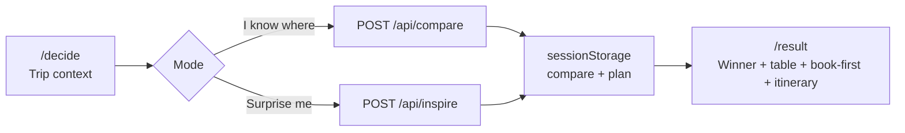

# XingAI Travel AI

**Explore Better** — compare destinations first, plan second.

Production target: [travel.xingai.app](https://travel.xingai.app)

XingAI Travel AI is a **travel decision system**, not an OTA or price-comparison wall. Users describe real trip constraints; the product compares a small set of destinations, names one winner with honest trade-offs, then offers a book-first checklist and itinerary. Affiliate links appear **after** the decision — they never influence ranking or confidence.

---

## Status (September 2026)

| Area | State |
|------|--------|
| **App shell** | Next.js 16 App Router, React 19, Tailwind 4. On desktop the sidebar stays fixed and the main column scrolls. |
| **Core flow** | `/decide` → compare or inspire → `/result` with plan |
| **Stories** | `/stories` after the decision ([ADR 0006](./docs/adr/0006-stories-after-decision.md)). Hong Kong EP01–EP02 published 2026-09-26; EP03–08 remain drafts. |
| **AI backend** | OpenAI JSON (`gpt-4o-mini` default), mock fallback when no API key |
| **i18n** | English, 中文, 한국어, Español |
| **Theme** | Light / dark, custom provider (React 19–safe) |
| **Affiliate** | Book-first module with optional partner IDs |
| **UX reference** | Static gallery in [`docs/ux-v1/`](./docs/ux-v1/) |
| **Architecture docs** | [`docs/adr/`](./docs/adr/) |
| **Tech blog** | [`docs/tech-blog/`](./docs/tech-blog/) (EN + 中文) |

---

## Product principles

Full copy: [`docs/PRODUCT-PRINCIPLES.md`](./docs/PRODUCT-PRINCIPLES.md)

1. **Decision quality first.** Winners, confidence, and trade-offs reflect trip fit — not commission.
2. **Compare before plan.** The default CTA is “Compare destinations”, not “Generate itinerary”.
3. **One clear winner.** Three options max; one recommended; alternatives explained honestly.
4. **Book-first on the result page.** Flights, hotel area, and key activity before day-by-day detail.
5. **Legal and affiliate disclosure** on dedicated pages and near booking links.
6. **Stories after the decision.** First-hand episodes never change the winner, ranking, confidence, or trade-offs. See [ADR 0006](./docs/adr/0006-stories-after-decision.md) and [docs/stories/README.md](./docs/stories/README.md).

Chinese shorthand used internally: **赚钱靠决策质量，联盟靠事后。**

---

## User flow



### Step 1 — Your trip (`/decide`)

- **Hero:** decision framing (“Where should I go — really?”), help accordion, primary CTA.
- **Mode toggle:**
  - **I know where I want to go** — full trip form (dates, origin, budget, travelers, style, pace, notes).
  - **Surprise me** — lightweight inspire chips (vibe, flight range, priority) + legal disclaimer.
- **Live preview:** compare result can render inline on `/decide` before navigating to `/result`.
- **Plan prefetch:** after compare succeeds, `/api/plan` runs in the background; result page polls `sessionStorage`.

### Step 2 — Compare / inspire (API)

- **`POST /api/compare`** — Zod-validated `TripContext` → `CompareResult` (3 destinations, 1 winner).
- **`POST /api/inspire`** — `InspireContext` → same `CompareResult` shape when user has no destination in mind.
- Responses are localized via `locale` in the payload (prompt language in `lib/prompts.ts`).

### Step 3 — Result (`/result`)

- **DestinationCompare** — winner hero, trade-offs, scrollable comparison table; tap a column to preview that city’s photo (recommendation copy stays on winner).
- **BookFirst** — affiliate-aware outbound links (Skyscanner, Booking.com, Expedia, Viator, GetYourGuide).
- **Itinerary** — simple + detailed day blocks; trip warnings when present.
- **Replan** — back to `/decide` with trip context restored from storage.

---

## Tech stack

| Layer | Choice |
|-------|--------|
| Framework | Next.js 16.2 (App Router, Turbopack dev) |
| UI | React 19, Tailwind CSS 4, Lucide icons |
| AI | OpenAI Chat Completions, `response_format: json_object` |
| Validation | Zod 3 |
| Analytics | Vercel Analytics (production only) |
| Deploy | Vercel → `travel.xingai.app` |
| Node | ≥ 20.9 |

Shell pattern forked from `xingai-meal-coach-ai` / `xingai-cook-ai`: shared chrome (sidebar, mobile drawer, bottom nav), locale switcher, theme toggle, legal pages.

---

## Project structure

```
xingai-travel-ai/
├── app/
│   ├── layout.tsx              # Fonts, SEO metadata, ThemeProvider, AppChrome
│   ├── page.tsx                # Redirect → /decide
│   ├── decide/page.tsx
│   ├── result/page.tsx
│   ├── privacy|terms|disclaimer|affiliate-disclosure/
│   ├── api/
│   │   ├── compare/route.ts    # Destination comparison
│   │   ├── inspire/route.ts    # Surprise-me suggestions
│   │   ├── plan/route.ts       # Itinerary + book-first + warnings
│   │   └── track/route.ts      # Affiliate click logging (stdout for now)
│   ├── llms.txt/route.ts       # AEO summary for crawlers
│   ├── robots.ts
│   └── sitemap.ts              # /result excluded (session-only)
├── components/
│   ├── app-chrome.tsx          # Sidebar, mobile drawer, bottom nav, last-trip card
│   ├── decide-page.tsx         # Hero, forms, compare CTA, inline preview
│   ├── result-page.tsx
│   ├── destination-compare.tsx # Table + column photo preview
│   ├── book-first.tsx          # Affiliate cards
│   ├── inspire-form.tsx
│   ├── trip-form.tsx, style-pace-selector.tsx, …
│   ├── locale-provider.tsx, theme-provider.tsx
│   └── seo-json-ld.tsx         # JSON-LD via next/script
├── lib/
│   ├── types.ts                # TripContext, CompareResult, PlanResult, …
│   ├── mock-data.ts            # Lisbon demo when API unavailable
│   ├── prompts.ts              # OpenAI prompt templates
│   ├── affiliate.ts            # Partner URL builders
│   ├── rate-limit.ts           # Per-IP daily demo limit
│   ├── seo-json-ld.ts
│   ├── utils.ts                # cn(), getCityImage()
│   └── i18n/                   # en, zh, ko, es
├── public/assets/              # Logos, favicons, Lisbon hero/card images
├── docs/
│   ├── PRODUCT-PRINCIPLES.md
│   ├── adr/                    # Architecture decision records
│   ├── tech-blog/              # EN + 中文 engineering posts
│   └── ux-v1/                  # Static HTML/CSS UX gallery
├── DEV-PLAN.md                 # Phase-by-phase build plan
├── DEV-PLAN-AFFILIATE.md       # Affiliate monetization plan
└── .env.example
```

---

## API reference

### `POST /api/compare`

**Body:** `TripContext` (see `lib/types.ts`)

**Response:** `CompareResult`

**Behavior:**

- No `OPENAI_API_KEY` → returns `mockCompareResult` (200).
- Invalid body → `400 BAD_REQUEST`.
- Rate limit exceeded → `429 RATE_LIMIT` (production default: 3/day/IP).
- OpenAI failure → one retry, then `502 OPENAI_ERROR`.

### `POST /api/inspire`

**Body:** `InspireContext`

**Response:** `CompareResult` (same shape as compare)

Same fallback, rate limit, and error semantics as compare.

### `POST /api/plan`

**Body:** `{ destination: string, tripContext: TripContext }`

**Response:** `PlanResult` (`itinerary`, `bookFirst`, `warnings`, …)

Triggered automatically after compare on the client. Does not consume an extra rate-limit slot (compare already counted).

### `POST /api/track`

**Body:** `{ platform, type: "flight"|"hotel"|"activity", destination }`

Logs affiliate clicks to server stdout. Replace with KV/Plausible when ready.

---

## Client storage

| Key | Purpose |
|-----|---------|
| `xingai-travel-trip-context` | Trip form state (`sessionStorage`) |
| `xingai-travel-compare-result` | Last compare/inspire result |
| `xingai-travel-plan-result` | Plan payload (may arrive after navigation) |
| `xingai-travel-locale` | UI language (`localStorage`) |
| `theme` | Light / dark / system (`localStorage`) |

Event `xingai-travel-compare-updated` refreshes the sidebar “Continue your last trip” card.

**Hydration rule:** never read storage in `useState` initializers. Use stable SSR defaults, then `useEffect` after mount. See [ADR 0003](./docs/adr/0003-session-storage-client-state.md).

---

## Environment variables

Copy [`.env.example`](./.env.example) → `.env.local`.

| Variable | Required | Description |
|----------|----------|-------------|
| `OPENAI_API_KEY` | For live AI | Without it, all API routes return mock data |
| `OPENAI_TRAVEL_MODEL` | No | Default `gpt-4o-mini` |
| `TRAVEL_DEMO_DAILY_LIMIT` | No | `0` = unlimited (local); omit/`3` in production |
| `NEXT_PUBLIC_APP_URL` | Yes (prod) | Canonical base URL for metadata |
| `NEXT_PUBLIC_*_AFFILIATE_*` | No | Partner IDs for book-first links |

---

## Local development

```bash
cd xingai-travel-ai
npm install
cp .env.example .env.local
# Set TRAVEL_DEMO_DAILY_LIMIT=0 and optionally OPENAI_API_KEY
npm run dev
```

Open [http://localhost:3000/decide](http://localhost:3000/decide).

```bash
npm run build    # production build
npm run lint     # ESLint
```

### UX gallery (static mock, no Next.js)

```bash
cd docs/ux-v1 && python3 -m http.server 8767
```

---

## Deployment (Vercel)

1. Connect repo; set root to `xingai-travel-ai`.
2. Env: `OPENAI_API_KEY`, `NEXT_PUBLIC_APP_URL=https://travel.xingai.app`, `TRAVEL_DEMO_DAILY_LIMIT=3`.
3. Optional affiliate IDs from partner dashboards.
4. Custom domain: `travel.xingai.app`.

---

## SEO & AEO

- Metadata + Open Graph in `app/layout.tsx`
- JSON-LD graph: Organization, WebSite, WebApplication, FAQPage, HowTo (`lib/seo-json-ld.ts`)
- `/robots.txt`, `/sitemap.xml` (static routes only)
- `/llms.txt` — plain-text product summary for AI crawlers

---

## Related documentation

| Doc | Description |
|-----|-------------|
| [docs/PRODUCT-PRINCIPLES.md](./docs/PRODUCT-PRINCIPLES.md) | Monetization and decision rules |
| [docs/adr/README.md](./docs/adr/README.md) | Architecture decision index |
| [docs/tech-blog/](./docs/tech-blog/) | Engineering blog (EN + 中文) |
| [docs/ux-v1/PRODUCT-FLOW.md](./docs/ux-v1/PRODUCT-FLOW.md) | Original V1 UX flow spec |
| [DEV-PLAN.md](./DEV-PLAN.md) | Build phases for AI agents |
| [DEV-PLAN-AFFILIATE.md](./DEV-PLAN-AFFILIATE.md) | Affiliate integration plan |

---

## License

Private — All rights reserved. © XingAI.
